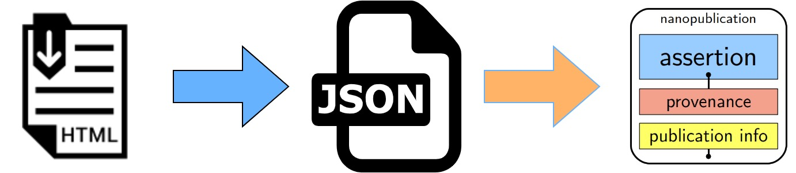

# Generation of annotations (from HTML to JSON).
In this process participate the following components:
- i) Annotated site,
- ii) Nanotate bookmark,
- iii) Nanotate client
- iv) BioPortal API.

## i) Annotated site:
We start on the web page of the protocol to be annotated. Nanotate takes as input full experimental
protocol documents in HTML. The HTML about the selection of
a sample ``(nucleic acid)``, is available [here](../resources/protocol-resume.html).

## ii) Nanotate
bookmark: Nanotate does not use the hypothes.is client (‘annotator’ and ‘sidebar’);
instead, it uses the bookmarklet approach in a similar way to [The HelloWorldAnnotated demo](https://github.com/judell/HelloWorldAnnotated). The ``“Nanotate bookmark”`` is used to redirect from an ``“Annotated Site”`` to the ``“Nanotate client”`` through a URL that contains data about the selected text to be annotated.

## iii) Nanotate client:
Our UI works as a template guiding users through the annotation process and posting the annotations 
to hypothes.is. The UI includes a tag box to add one or multiple tags
from the available options ``(“sample”, “equipment”, “reagent”, “input”, “output”,
“step”)``. After labeling the selected text, a JSON file in which hypothes.is stores
the annotation is generated.

## iv) BioPortal API:
The next step is adding context to the tagged text by using ontology terms. Nanotate facilitates the connection
with the BioPortal API for consulting the 8 ontologies mentioned above. When it is possible to link a tagged text to an ontology term, the resulting JSON includes the URI of the ontology term. All annotations about steps and the material entities participating on each one of them are posted to Hypothes.is. An example about the resulting JSON is available [here](../resources/annotation-JJN3mnbcEeuMqWOKn34VBA.json).

# Generation of nanopublications (from JSON to RDF).
Here is generated the publication of each annotated step and their components as nanopublica-
tions. In this process participate the component Nanopub library. To generate
the nanopublications, the users just press the button ``“Nanopub”`` located in each
annotated step. The nanopub library was configured to group annotations according 
to their text position. These are grouped, if an annotation that does not
have the tag ``“step”`` is contained in an annotation that does have a tag ``“step”``. All
annotations are sent to Nanotate via API where validation is done and subsequent publication. In addition, the published nanopublications are stored locally in a MongoDB data storage. A nanopublication in RDF is available [here](http://purl.org/np/RA40wBBmgSDD09QDgNFVNVYtUbrE4WvKPJmkRI6rJgshY).

# Generation of RDF workflows.
Once having all the nanopublications for the individual steps, the next step is creating the corresponding workflow. Here, Nanotate client, the users consult the nanopublications and press the button
``“new workflow”``. Then, users register the fields: 
i) label: to add a name to the workflow to be created
ii) description: short description about the new workflow. 
Finally, the users select the nanopublications that are part of the
workflow. The resulting nanopublications are then published as above. The published 
nanopublications about workflows are also stored locally in a MongoDB
data storage. A nanopublication about a workflow in RDF is available [here](http://purl.org/np/RA9fL5Ge98ru-fkf_C4b6yrC3HP5mq_s-pUCUMqxKjDMQ).

Nanotate is a free and open source tool. The code behind the tool is available on [Github](https://github.com/nanotate-tool).
End-users can install it by creating a bookmark.
The documentation about how to install and use the
Nanotate is available at http://doi.org/10.5281/zenodo.5101941 A running
instance of the tool can be found https://nanotate.bitsfetch.com